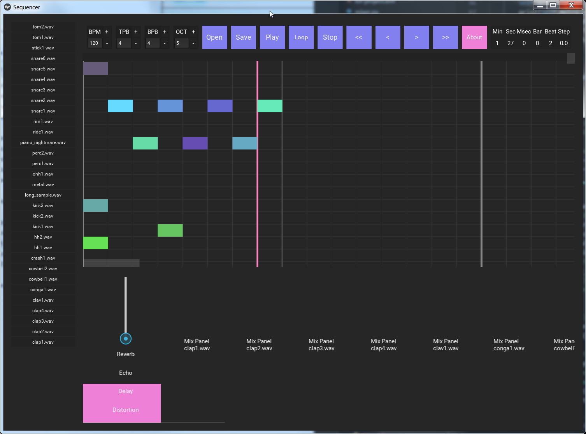

# Kivy Sequencer


>###### WIP music sequencer



## Installation

Requires:
- Python 3.6
- Kivy 2.0.0+
- [pyo_0.9.1_py3.6_setup.exe](http://ajaxsoundstudio.com/downloads/pyo_0.9.1_py3.6_setup.exe)
- [Kivy-2.0.0.dev0-cp36-cp36m-win32.whl](https://kivy.org/downloads/appveyor/kivy/Kivy-2.0.0.dev0-cp36-cp36m-win32.whl)

```sh
pip install -r requirements.txt
(if above fails)
pip install Kivy-2.0.0.dev0-cp36-cp36m-win32.whl
pip install kivy_deps.sdl2
pip install kivy_deps.gstreamer
pip install kivy_deps.glew
```

Pyo must be compiled from source if running on Linux.

## Usage example
Run:
```sh
python kivy_sequencer.py
```

## Development setup

Install the requirements as listed above and run the file directly.

```sh
python kivy_sequencer.py
```

## Release History

* 0.0.1
    * First release, (rough) work in progress

## Meta

Sam H. – [@shuff_co](https://twitter.com/shuff_co) – syfenx@gmail.com

[https://github.com/syfenx/](https://github.com/syfenx/)

## Contributing

1. Fork it (<https://github.com/syfenx/kivysequencer/fork>)
2. Create your feature branch (`git checkout -b feature/fooBar`)
3. Commit your changes (`git commit -am 'Add some fooBar'`)
4. Push to the branch (`git push origin feature/fooBar`)
5. Create a new Pull Request